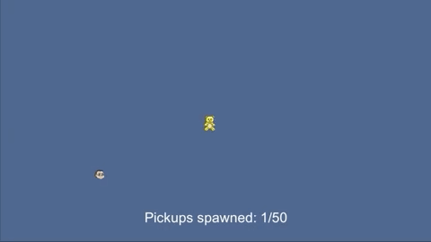

# TedTheRoboCollector
A small game where you haven't to do anything. Just watch like a teddy bear 🐻 collecting the nearest robot one by one. It was a part of course "Data Structures and Algorithms from University of Colorado". I've implemented here own Generic SortedList (and Dynamic Array before) to learn how to code stuff on C#.

